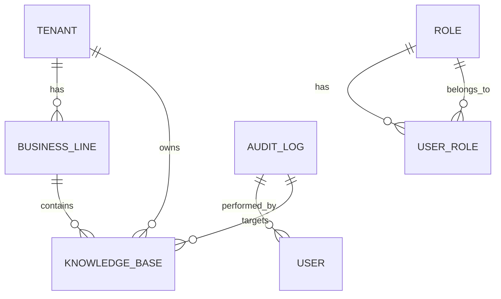

# 阶段P2：权限管理与多租户 - 实现计划

## 1. 需求分析

### 1.1 目标概述
实现多租户架构和细粒度权限控制体系，支持 RBAC+ABAC 混合模式。

### 1.2 任务清单
| 序号 | 任务 | 状态 | 依赖 |
|:---:|---|:---:|:---:|
| 1 | 租户实体设计：Tenant、BusinessLine 实体类 | 待开发 | 无 |
| 2 | 角色实体设计：Role、UserRole 实体类 | 待开发 | 无 |
| 3 | 知识库扩展：扩展 KnowledgeBase 添加 tenantUuid、businessLineUuid | 待开发 | 已有基础 |
| 4 | 权限服务实现：KnowledgeBasePermissionService 权限校验 | 待开发 | 实体类 |
| 5 | 细粒度权限：FineGrainedPermissionService ABAC 支持 | 待开发 | 实体类 |
| 6 | 租户隔离查询：实现数据隔离的查询方法 | 待开发 | 权限服务 |
| 7 | 权限管理 API：TenantController、RoleController | 待开发 | 服务层 |
| 8 | 审计日志：AuditService 审计记录 | 待开发 | 无 |
| 9 | 数据保护：DataProtectionService 加密脱敏 | 待开发 | 无 |
| 10 | 测试用例：权限测试、隔离测试 | 待开发 | 所有功能 |

### 1.3 技术要求
- 支持 RBAC+ABAC 混合模式
- 租户级数据隔离
- 敏感数据加密存储
- 操作审计日志记录

---

## 2. 架构设计

### 2.1 实体关系图

### 2.2 核心组件

| 组件 | 职责 | 状态 |
|:---|:---|:---:|
| Tenant | 租户实体 | 待创建 |
| BusinessLine | 业务线实体 | 待创建 |
| Role | 角色实体 | 待创建 |
| UserRole | 用户角色关联 | 待创建 |
| AuditLog | 审计日志实体 | 待创建 |
| TenantService | 租户管理服务 | 待创建 |
| RoleService | 角色管理服务 | 待创建 |
| KnowledgeBasePermissionService | 知识库权限校验 | 待创建 |
| FineGrainedPermissionService | ABAC细粒度权限 | 待创建 |
| AuditService | 审计日志服务 | 待创建 |
| DataProtectionService | 数据加密脱敏 | 待创建 |
| TenantController | 租户管理API | 待创建 |
| RoleController | 角色管理API | 待创建 |

---

## 3. 文件清单

### 3.1 新增文件

| 文件路径 | 文件类型 | 说明 |
|:---|:---|:---|
| `entity/Tenant.java` | 实体类 | 租户实体 |
| `entity/BusinessLine.java` | 实体类 | 业务线实体 |
| `entity/Role.java` | 实体类 | 角色实体 |
| `entity/UserRole.java` | 实体类 | 用户角色关联 |
| `entity/AuditLog.java` | 实体类 | 审计日志实体 |
| `mapper/TenantMapper.java` | Mapper接口 | 租户数据访问 |
| `mapper/BusinessLineMapper.java` | Mapper接口 | 业务线数据访问 |
| `mapper/RoleMapper.java` | Mapper接口 | 角色数据访问 |
| `mapper/UserRoleMapper.java` | Mapper接口 | 用户角色数据访问 |
| `mapper/AuditLogMapper.java` | Mapper接口 | 审计日志数据访问 |
| `service/TenantService.java` | 服务类 | 租户管理服务 |
| `service/RoleService.java` | 服务类 | 角色管理服务 |
| `service/KnowledgeBasePermissionService.java` | 服务类 | 知识库权限校验 |
| `service/FineGrainedPermissionService.java` | 服务类 | ABAC细粒度权限 |
| `service/AuditService.java` | 服务类 | 审计日志服务 |
| `service/DataProtectionService.java` | 服务类 | 数据保护服务 |
| `controller/TenantController.java` | 控制器 | 租户管理API |
| `controller/RoleController.java` | 控制器 | 角色管理API |
| `dto/request/TenantCreateRequest.java` | DTO | 租户创建请求 |
| `dto/request/TenantUpdateRequest.java` | DTO | 租户更新请求 |
| `dto/request/RoleCreateRequest.java` | DTO | 角色创建请求 |
| `dto/request/RoleUpdateRequest.java` | DTO | 角色更新请求 |
| `dto/request/UserRoleAssignRequest.java` | DTO | 用户角色分配请求 |
| `dto/response/TenantResponse.java` | DTO | 租户响应 |
| `dto/response/RoleResponse.java` | DTO | 角色响应 |

### 3.2 修改文件

| 文件路径 | 修改内容 |
|:---|:---|
| `entity/KnowledgeBase.java` | 已有 tenantUuid、businessLineUuid 字段，确认完整性 |
| `exception/ErrorCode.java` | 添加权限相关错误码 |

---

## 4. 数据库设计

### 4.1 租户表 (kes_tenant)

| 字段名 | 类型 | 约束 | 说明 |
|:---|:---|:---|:---|
| id | BIGSERIAL | PRIMARY KEY | 主键ID |
| uuid | VARCHAR(36) | NOT NULL, UNIQUE | 租户UUID |
| name | VARCHAR(128) | NOT NULL | 租户名称 |
| code | VARCHAR(64) | NOT NULL, UNIQUE | 租户编码 |
| description | TEXT | | 租户描述 |
| status | VARCHAR(32) | NOT NULL DEFAULT 'ACTIVE' | 租户状态 |
| config_json | TEXT | | 租户配置 |
| created_time | TIMESTAMP | NOT NULL DEFAULT NOW() | 创建时间 |
| updated_time | TIMESTAMP | NOT NULL DEFAULT NOW() | 更新时间 |

### 4.2 业务线表 (kes_business_line)

| 字段名 | 类型 | 约束 | 说明 |
|:---|:---|:---|:---|
| id | BIGSERIAL | PRIMARY KEY | 主键ID |
| uuid | VARCHAR(36) | NOT NULL, UNIQUE | 业务线UUID |
| tenant_uuid | VARCHAR(36) | NOT NULL, FK | 租户UUID |
| name | VARCHAR(128) | NOT NULL | 业务线名称 |
| code | VARCHAR(64) | NOT NULL | 业务线编码 |
| description | TEXT | | 业务线描述 |
| created_time | TIMESTAMP | NOT NULL DEFAULT NOW() | 创建时间 |
| updated_time | TIMESTAMP | NOT NULL DEFAULT NOW() | 更新时间 |

### 4.3 角色表 (kes_role)

| 字段名 | 类型 | 约束 | 说明 |
|:---|:---|:---|:---|
| id | BIGSERIAL | PRIMARY KEY | 主键ID |
| uuid | VARCHAR(36) | NOT NULL, UNIQUE | 角色UUID |
| tenant_uuid | VARCHAR(36) | FK | 租户UUID（NULL表示系统角色） |
| name | VARCHAR(128) | NOT NULL | 角色名称 |
| code | VARCHAR(64) | NOT NULL, UNIQUE | 角色编码 |
| description | TEXT | | 角色描述 |
| permissions | TEXT | | 权限列表JSON |
| is_system | BOOLEAN | NOT NULL DEFAULT FALSE | 是否系统角色 |
| created_time | TIMESTAMP | NOT NULL DEFAULT NOW() | 创建时间 |
| updated_time | TIMESTAMP | NOT NULL DEFAULT NOW() | 更新时间 |

### 4.4 用户角色表 (kes_user_role)

| 字段名 | 类型 | 约束 | 说明 |
|:---|:---|:---|:---|
| id | BIGSERIAL | PRIMARY KEY | 主键ID |
| user_id | BIGINT | NOT NULL | 用户ID |
| role_uuid | VARCHAR(36) | NOT NULL, FK | 角色UUID |
| tenant_uuid | VARCHAR(36) | NOT NULL | 租户UUID |
| created_time | TIMESTAMP | NOT NULL DEFAULT NOW() | 创建时间 |

### 4.5 审计日志表 (kes_audit_log)

| 字段名 | 类型 | 约束 | 说明 |
|:---|:---|:---|:---|
| id | BIGSERIAL | PRIMARY KEY | 主键ID |
| uuid | VARCHAR(36) | NOT NULL, UNIQUE | 日志UUID |
| user_id | BIGINT | | 用户ID |
| user_name | VARCHAR(128) | | 用户名称 |
| tenant_uuid | VARCHAR(36) | | 租户UUID |
| operation_type | VARCHAR(64) | NOT NULL | 操作类型 |
| resource_type | VARCHAR(64) | | 资源类型 |
| resource_uuid | VARCHAR(36) | | 资源UUID |
| resource_name | VARCHAR(256) | | 资源名称 |
| operation_detail | TEXT | | 操作详情 |
| success | BOOLEAN | NOT NULL | 是否成功 |
| error_message | TEXT | | 错误信息 |
| client_ip | VARCHAR(64) | | 客户端IP |
| user_agent | TEXT | | 用户代理 |
| created_time | TIMESTAMP | NOT NULL DEFAULT NOW() | 创建时间 |

---

## 5. API 接口设计

### 5.1 租户管理 API

| API路径 | HTTP方法 | 功能 | Controller文件 |
|:---|:---|:---|:---|
| `/api/tenant` | POST | 创建租户 | TenantController |
| `/api/tenant` | GET | 查询租户列表 | TenantController |
| `/api/tenant/{uuid}` | GET | 查询租户详情 | TenantController |
| `/api/tenant/{uuid}` | PUT | 更新租户信息 | TenantController |
| `/api/tenant/{uuid}` | DELETE | 删除租户 | TenantController |
| `/api/tenant/{tenantUuid}/business-line` | POST | 创建业务线 | TenantController |
| `/api/tenant/{tenantUuid}/business-line` | GET | 查询业务线列表 | TenantController |
| `/api/tenant/{tenantUuid}/business-line/{blUuid}` | GET | 查询业务线详情 | TenantController |
| `/api/tenant/{tenantUuid}/business-line/{blUuid}` | PUT | 更新业务线 | TenantController |
| `/api/tenant/{tenantUuid}/business-line/{blUuid}` | DELETE | 删除业务线 | TenantController |

### 5.2 角色管理 API

| API路径 | HTTP方法 | 功能 | Controller文件 |
|:---|:---|:---|:---|
| `/api/role` | POST | 创建角色 | RoleController |
| `/api/role` | GET | 查询角色列表 | RoleController |
| `/api/role/{uuid}` | GET | 查询角色详情 | RoleController |
| `/api/role/{uuid}` | PUT | 更新角色信息 | RoleController |
| `/api/role/{uuid}` | DELETE | 删除角色 | RoleController |
| `/api/role/{roleUuid}/assign` | POST | 分配角色给用户 | RoleController |
| `/api/role/{roleUuid}/revoke` | POST | 撤销用户角色 | RoleController |
| `/api/role/user/{userId}` | GET | 查询用户角色列表 | RoleController |

### 5.3 权限校验 API

| API路径 | HTTP方法 | 功能 | Controller文件 |
|:---|:---|:---|:---|
| `/api/permission/check` | POST | 检查权限 | PermissionController |

---

## 6. 核心服务设计

### 6.1 KnowledgeBasePermissionService

| 方法名 | 功能 | 参数 | 返回值 |
|:---|:---|:---|:---|
| `hasPermission(Long userId, String kbUuid)` | 检查用户是否有知识库权限 | userId: 用户ID, kbUuid: 知识库UUID | boolean |
| `hasPermission(Long userId, String kbUuid, String action)` | 检查用户是否有指定操作权限 | userId, kbUuid, action: 操作类型 | boolean |
| `filterAccessibleKbs(Long userId, List<KnowledgeBase> kbs)` | 过滤用户可访问的知识库 | userId, kbs: 知识库列表 | List<KnowledgeBase> |

### 6.2 FineGrainedPermissionService

| 方法名 | 功能 | 参数 | 返回值 |
|:---|:---|:---|:---|
| `hasPermission(Long userId, String resourceType, String resourceUuid, String action)` | ABAC权限检查 | userId, resourceType, resourceUuid, action | boolean |
| `checkAccess(Long userId, String resourceType, String resourceUuid, String action)` | 检查并抛出异常 | userId, resourceType, resourceUuid, action | void |
| `evaluateCondition(String condition, Map<String, Object> context)` | 评估ABAC条件 | condition: 条件表达式, context: 上下文 | boolean |

### 6.3 AuditService

| 方法名 | 功能 | 参数 | 返回值 |
|:---|:---|:---|:---|
| `log(String operationType, String resourceType, String resourceUuid, String resourceName)` | 记录审计日志 | operationType, resourceType, resourceUuid, resourceName | void |
| `log(String operationType, String resourceType, String resourceUuid, String resourceName, boolean success, String errorMessage)` | 记录审计日志（含结果） | 同上 + success, errorMessage | void |
| `queryLogs(Map<String, Object> conditions, int page, int size)` | 查询审计日志 | conditions: 查询条件, page, size | Page<AuditLog> |

### 6.4 DataProtectionService

| 方法名 | 功能 | 参数 | 返回值 |
|:---|:---|:---|:---|
| `encrypt(String plainText)` | 加密文本 | plainText: 明文 | String (密文) |
| `decrypt(String cipherText)` | 解密文本 | cipherText: 密文 | String (明文) |
| `maskEmail(String email)` | 邮箱脱敏 | email: 原始邮箱 | String (脱敏后) |
| `maskPhone(String phone)` | 手机号脱敏 | phone: 原始手机号 | String (脱敏后) |
| `maskIdCard(String idCard)` | 身份证脱敏 | idCard: 原始身份证 | String (脱敏后) |

---

## 7. 实现步骤

### 7.1 第一阶段：实体类创建

| 步骤 | 任务 | 预计工时 |
|:---:|---|:---|
| 7.1.1 | 创建 Tenant 实体类 | 30分钟 |
| 7.1.2 | 创建 BusinessLine 实体类 | 30分钟 |
| 7.1.3 | 创建 Role 实体类 | 30分钟 |
| 7.1.4 | 创建 UserRole 实体类 | 30分钟 |
| 7.1.5 | 创建 AuditLog 实体类 | 30分钟 |

### 7.2 第二阶段：Mapper 创建

| 步骤 | 任务 | 预计工时 |
|:---:|---|:---|
| 7.2.1 | 创建 TenantMapper | 30分钟 |
| 7.2.2 | 创建 BusinessLineMapper | 30分钟 |
| 7.2.3 | 创建 RoleMapper | 30分钟 |
| 7.2.4 | 创建 UserRoleMapper | 30分钟 |
| 7.2.5 | 创建 AuditLogMapper | 30分钟 |

### 7.3 第三阶段：DTO 创建

| 步骤 | 任务 | 预计工时 |
|:---:|---|:---|
| 7.3.1 | 创建 TenantCreateRequest | 20分钟 |
| 7.3.2 | 创建 TenantUpdateRequest | 20分钟 |
| 7.3.3 | 创建 TenantResponse | 20分钟 |
| 7.3.4 | 创建 RoleCreateRequest | 20分钟 |
| 7.3.5 | 创建 RoleUpdateRequest | 20分钟 |
| 7.3.6 | 创建 RoleResponse | 20分钟 |
| 7.3.7 | 创建 UserRoleAssignRequest | 20分钟 |

### 7.4 第四阶段：服务层实现

| 步骤 | 任务 | 预计工时 |
|:---:|---|:---|
| 7.4.1 | 创建 TenantService | 1小时 |
| 7.4.2 | 创建 RoleService | 1小时 |
| 7.4.3 | 创建 KnowledgeBasePermissionService | 1.5小时 |
| 7.4.4 | 创建 FineGrainedPermissionService | 1.5小时 |
| 7.4.5 | 创建 AuditService | 1小时 |
| 7.4.6 | 创建 DataProtectionService | 1小时 |

### 7.5 第五阶段：控制器实现

| 步骤 | 任务 | 预计工时 |
|:---:|---|:---|
| 7.5.1 | 创建 TenantController | 1小时 |
| 7.5.2 | 创建 RoleController | 1小时 |

### 7.6 第六阶段：测试用例

| 步骤 | 任务 | 预计工时 |
|:---:|---|:---|
| 7.6.1 | 租户隔离测试 | 1小时 |
| 7.6.2 | 角色权限测试 | 1小时 |
| 7.6.3 | 审计日志测试 | 1小时 |

---

## 8. 依赖与环境

### 8.1 新增依赖

| 依赖名称 | GroupId | ArtifactId | 版本 | 用途 |
|:---|:---|:---|:---|:---|
| Jasypt | org.jasypt | jasypt-spring-boot3-starter | 3.0.5 | 数据加密 |
| Spring Security | org.springframework.boot | spring-boot-starter-security | 4.0.x | 权限框架（可选） |

### 8.2 环境要求

- Java 21+
- Spring Boot 4.0.x
- MyBatis Plus 3.5.16
- PostgreSQL 15+

---

## 9. 风险评估

| 风险项 | 风险等级 | 缓解措施 |
|:---|:---:|:---|
| 数据库表不存在 | 高 | 使用 MyBatis Plus 自动建表或手动执行 SQL |
| 权限校验性能问题 | 中 | 引入 Redis 缓存用户角色信息 |
| 敏感数据泄露 | 高 | 使用 DataProtectionService 加密存储 |
| 审计日志过大 | 中 | 定期归档清理旧日志 |
| 租户隔离失效 | 高 | 在 Service 层强制校验租户上下文 |

---

## 10. 验收标准

| 验收项 | 验收标准 |
|:---|:---|
| 租户隔离测试 | 通过 |
| 角色权限校验 | 准确 |
| 审计日志 | 完整记录 |
| 单元测试覆盖率 | ≥80% |
| API 接口 | 完整可用 |

---

## 11. 输出清单

| 输出类型 | 输出内容 |
|:---|:---|
| 实体类 | Tenant、BusinessLine、Role、UserRole、AuditLog |
| 服务层 | TenantService、RoleService、KnowledgeBasePermissionService、FineGrainedPermissionService、AuditService、DataProtectionService |
| 控制器 | TenantController、RoleController |
| 数据库表 | kes_tenant、kes_business_line、kes_role、kes_user_role、kes_audit_log |
| DTO | TenantCreateRequest、TenantUpdateRequest、TenantResponse、RoleCreateRequest、RoleUpdateRequest、RoleResponse、UserRoleAssignRequest |
| Mapper | TenantMapper、BusinessLineMapper、RoleMapper、UserRoleMapper、AuditLogMapper |